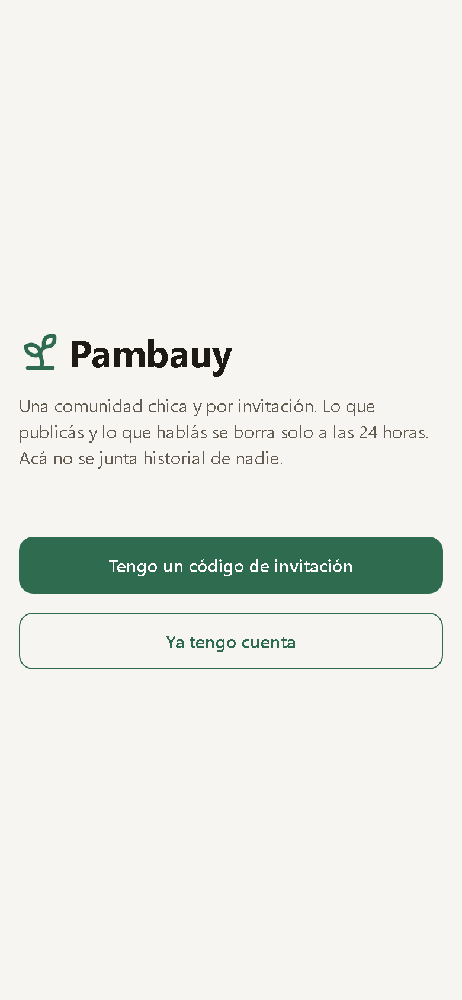
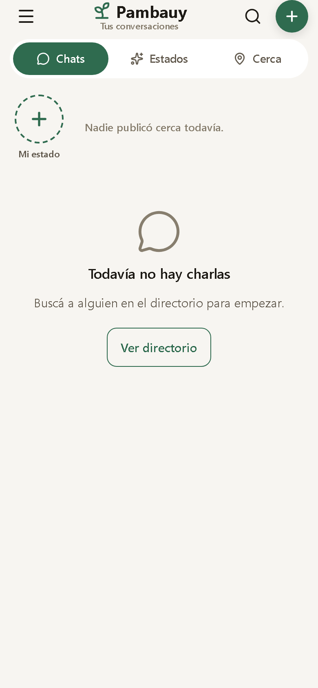
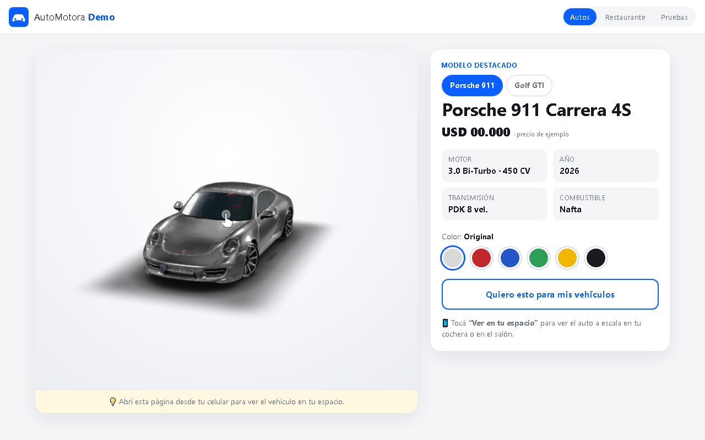
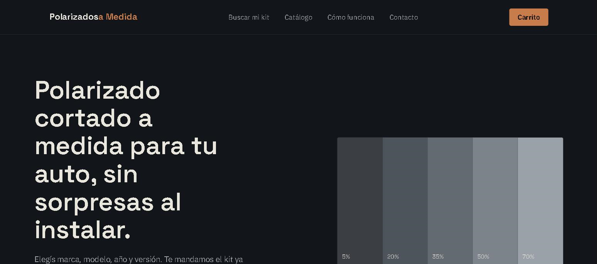

# Bruno Rodríguez

**Desarrollador de software autodidacta · Automatización, bots, e-commerce y apps para negocios** · Uruguay

Construyo herramientas que resuelven tareas concretas de negocios: bots que automatizan la carga de productos en Shopify, sistemas de pedidos y stock por Telegram, apps móviles con backend propio y tiendas online. También trabajo del lado técnico e infraestructura: cámaras IP, videovigilancia y soporte técnico.

[LinkedIn](https://www.linkedin.com/in/brunorodriguez-dev) · Abierto a trabajo como desarrollador y a proyectos freelance.

---

## Qué hago

- **Automatización y bots**: bots de Telegram que reemplazan tareas manuales (carga de productos, pedidos, stock, notificaciones al equipo).
- **E-commerce y Shopify**: integraciones con la Shopify Admin API (GraphQL), importación de catálogo y tiendas a medida con pagos por Mercado Pago.
- **Aplicaciones**: apps Android nativas (Kotlin) y multiplataforma (Expo / React Native) con backend en Node.js.
- **Infraestructura y hardware**: instalación de cámaras de seguridad, integración con cámaras IP (RTSP / DVRIP) y soporte técnico.

## Proyectos destacados

### Shopify Product Importer · [código](https://github.com/brunorod631-byte/shopify-product-importer-portfolio)

Bot de Telegram que recibe el enlace de un producto de un proveedor y lo convierte en un **borrador en Shopify** listo para revisar.

- **Problema:** cargar productos a mano en una tienda Shopify (título, precio convertido a pesos, fotos, specs, SKU) es lento y propenso a errores.
- **Qué hace:** extractores específicos por proveedor con fallback JSON-LD / Open Graph, limpieza de títulos y descripciones, conversión de moneda a UYU con recargo configurable, procesamiento y deduplicación de imágenes, detección de productos duplicados, vista previa editable en Telegram y creación del producto en estado `DRAFT` vía GraphQL.
- **Seguridad:** acceso restringido por ID de Telegram, validación de URLs públicas (bloquea IPs internas), redacción de secretos en logs.
- **Stack:** Python, python-telegram-bot, httpx, BeautifulSoup, Pydantic, SQLAlchemy, Pillow, Playwright, Shopify Admin GraphQL, Docker.
- **Estado:** versión pública saneada del proyecto, con demo offline y 40 tests en CI (GitHub Actions) que corren sin credenciales.

### Bots de Telegram para comercios · código privado

- **Pedidos y stock para una ferretería:** carga de productos por foto, búsqueda, categorías, libreta de crédito de clientes, notificaciones al staff y chequeo de salud del servicio.
- **Comandero para restaurante:** mesas, comandas, pantalla de cocina y estados de pedido.
- **Stack:** Python, python-telegram-bot, despliegue en la nube.

### CamLibre · código privado

App Android propia, sin publicidad, para ver y configurar cámaras domo Xiongmai / iCSee sin depender de la app del fabricante.

- Video en vivo por **DVRIP y RTSP**, validado con cámara física.
- **Aprovisionamiento WiFi por Bluetooth** implementado a partir de ingeniería inversa del protocolo.
- **Stack:** Kotlin, Android.

### PambaUy · código privado

App móvil + backend para una comunidad por invitación con mensajería efímera: chats en tiempo real, estados tipo historia (foto, texto, video) y ubicación compartida solo a pedido. Todo se borra a las 24 h.

- Registro por invitación + alias + PIN, WebSocket, moderación y reportes, pagos con Mercado Pago.
- Privacidad por diseño: se eliminan los metadatos GPS de fotos y videos, sin tracking.
- **Stack:** Expo / React Native, Node.js, TypeScript, SQLite.

  
  

### WebAR · [demo en vivo](https://brunorod631-byte.github.io/webar-demo) · [código](https://github.com/brunorod631-byte/webar-demo)

Fichas de producto en **realidad aumentada que corren en el navegador del celular**, sin instalar apps: el cliente ve un auto o un plato a escala real en su espacio.

- Ficha de vehículo con selector de modelos y cambio de color, menú de restaurante en RA, generador de QR para el local.
- Prototipos experimentales: personaje interactivo en RA/VR con WebXR y zapatilla sobre el pie con MediaPipe.
- **Stack:** HTML/CSS/JS sin build, `<model-viewer>`, three.js, WebXR, GitHub Pages.

### Polarizados a Medida · código privado

Tienda online de kits de polarizado por modelo de vehículo: selector de vehículo, catálogo, carrito y checkout.

- **Stack:** Next.js, Prisma, PostgreSQL (Neon), Mercado Pago.

## Experiencia aplicada: ferretería en Uruguay

Desarrollo de soluciones para una ferretería, cubriendo necesidades técnicas del día a día del negocio:

- **Tienda Shopify y catálogo:** automatización de la carga de productos desde sitios de proveedores.
- **Bots internos:** gestión de pedidos, stock y notificaciones al personal por Telegram.
- **Sistemas internos y automatización de procesos** que antes se hacían a mano.
- **Soporte técnico** del equipamiento y los sistemas del local.

El código de estos sistemas es privado; el [Shopify Product Importer](https://github.com/brunorod631-byte/shopify-product-importer-portfolio) muestra el tipo de trabajo en una versión pública y sin datos reales.

## Sobre los proyectos privados

Varios de estos proyectos están en uso por negocios reales o son productos en desarrollo, así que su código no es público. Puedo mostrar la arquitectura, las funcionalidades, documentación y demos en vivo sin exponer código ni datos de terceros.

## Stack

Además: Telegram Bot API, SQLAlchemy / Prisma, SQLite, Mercado Pago, three.js / WebXR, GitHub Actions.

## Contacto

[LinkedIn](https://www.linkedin.com/in/brunorodriguez-dev)
